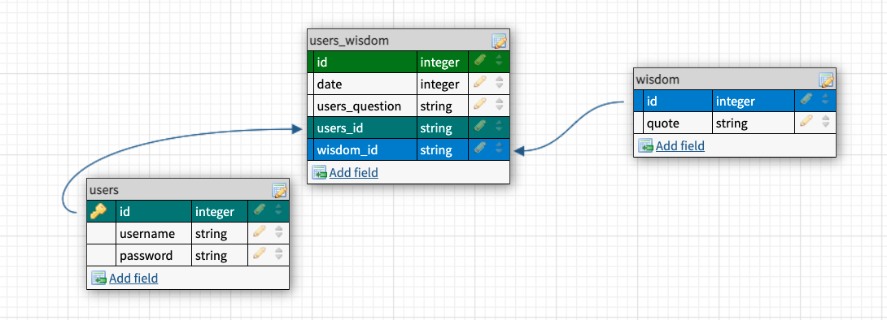
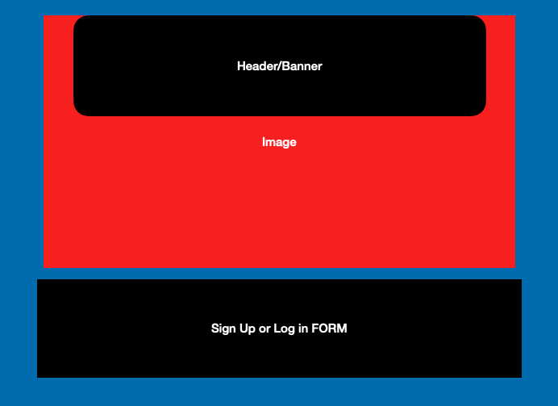
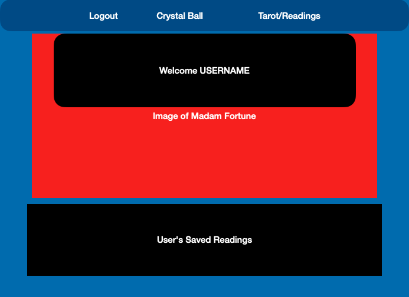
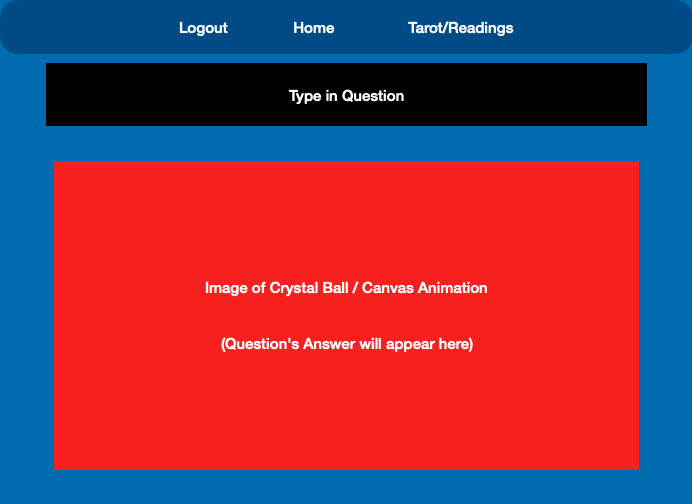
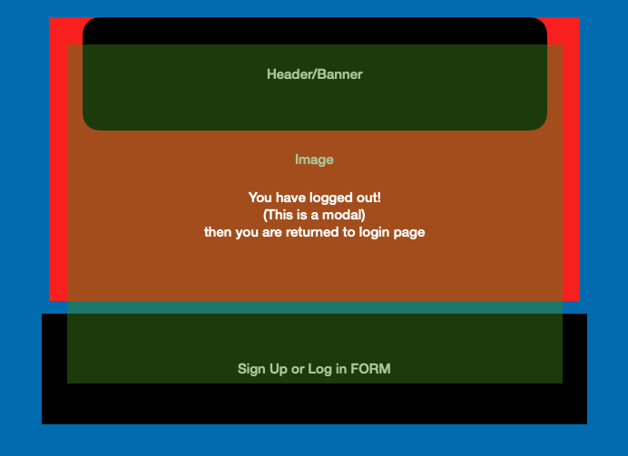

# Hard Pitch

### App Name:

current working title: Madam's Parlor of Fortune

### Description:

Our user is someone on-the-go seeking advise. Our app will be a one-stop-shop that offers many different types of wisdom and advice. Whether you need a daily horoscope, a reading from a fortune teller or words of wisdom from a magic-8 ball, you are covered. Also, the user may log back into their account to see past dated readings.

### User Story:

1.  The user first sees the log in page. They are given the option to sign in or sign up.
2.  Once logged in the user's home page greets them. It also reveals the navigation bar.
3.  The navigation bar offers 4 choices:
    a. Logout
    b. User's Homepage
    c. Magic 8-ball
    d. Crystal ball (STRETCH)
4.  The user's homepage is a space unique to them. There is a display of past readings.
5.  The user can click to generate advise from the magic 8 ball or crystal ball, and it will show in their homepage automatically.
6.  Log out returns you to the sign in page, with a temporary modal that says "Bye!"

### Group Roles:

Semuel- mernAuth

Erin- Visuals, site structuring

Nakisha- front end/react

Brinn- Back end/mongo db

### Git Master:

Erin

### Sprints:

Est. of day 1- Create a repo, and the whole group interacts with is. Structure the site (lay it out), and place
routes. Structure Crystal Ball modules in db.

### Routes:

Login "/login"

Users Homepage "/"

Crystal Ball "/crystal-ball"

Logout "/logout"

### Schema:

### Technologies and APIs:

React, Mongoose, MongoDB, mernAuth, Express, Axios, CSS, html, Javascript, Rowdy-Logger, Morgan, React-Router-Dom, Canvas, [Mystic API](https://rapidapi.com/mysticscripts/)

### Wire Frames:

